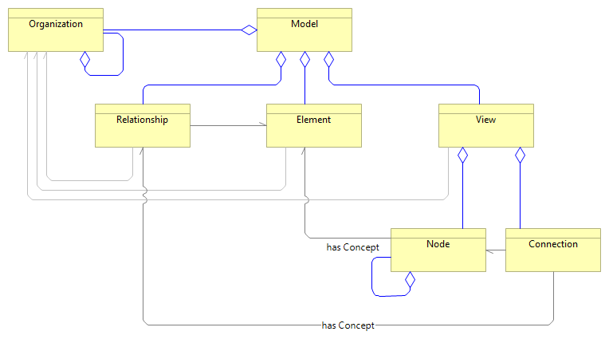

# pyArchimate package

pyArchimate is a Python library to manage [Open Group Archimate ](https://www.opengroup.org/xsd/archimate/) files.

It enables to:

* Read or write a file in Archimate xml format
* create new models
* Create, update and delete Archimate artefacts
* Create, update and delete diagrams

The following artefacts are implemented as per the metamodel here below:

* Model: a set of architecture concepts that relate together and their visual representation in views
* View:  a specific visualization of element and their conns in a diagram
* Element: architectural concepts of Archimate language
* Relationship: the architectural concept expressing the relation between two Elements
* Node: the visual representation of an Element in a View
* Connection: the visual representation of a Relationship in a View

