:orphan:

Diagrams
========

The files in ``docs/diagrams`` are PlantUML sources that document the architecture of
pyArchimate. They include both classic UML views (class, component, object, deployment, etc.)
and derived C4-style diagrams that illustrate how the project is composed.

Available diagrams:

The rendered PNG artifacts live next to the PlantUML sources (``docs/diagrams/*.png``) and are overwritten each time you run ``scripts/render_diagrams.sh``. Including them in the docs allows the website to display the diagrams without requiring a PlantUML renderer on the client side.

``context.puml`` / ``c4_context.puml``
  Context diagram showing how pyArchimate integrates with external tooling, developers, and
  the ArchiMate standard.

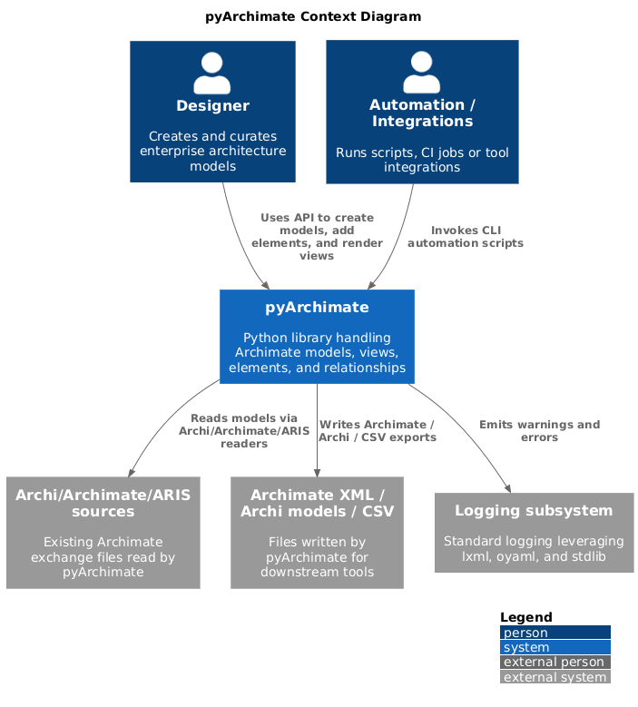

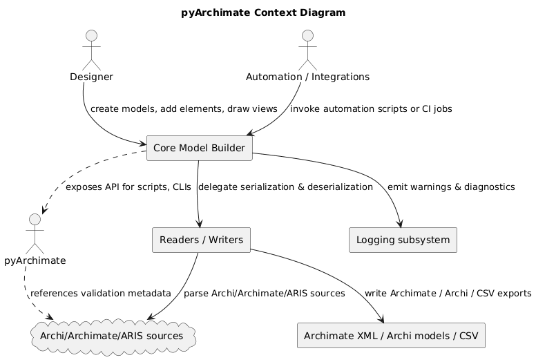

``package.puml`` / ``c4_container.puml``
  Container diagram showing how pyArchimate integrates with external tooling, developers, and
  the ArchiMate standard.

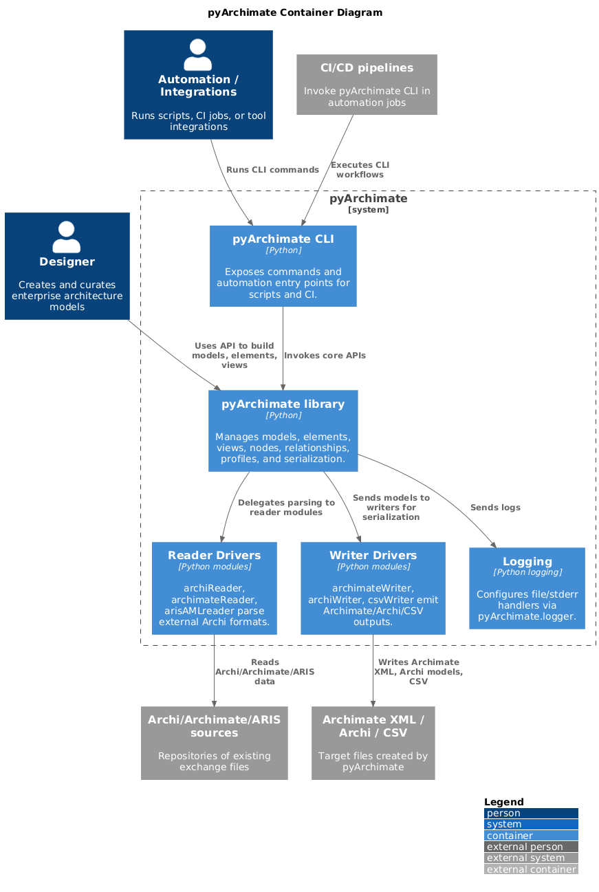

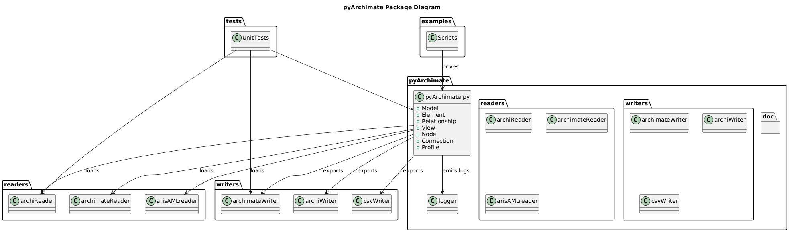

``component.puml`` / ``c4_component.puml``
  Component diagrams that highlight the major modules such as the model core, readers, and writers.

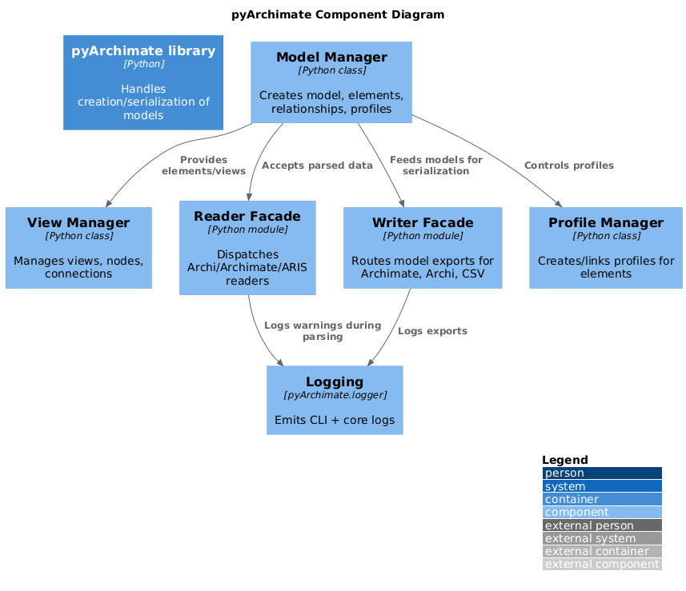

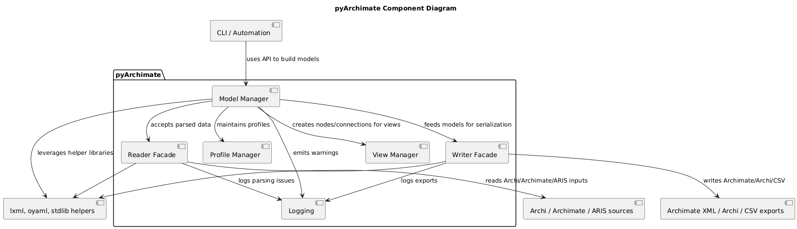

``deployment.puml`` / ``c4_deployment.puml``
  Deployment diagrams describing the runtime environment, processing steps, and how the PlantUML
  renderer/slim server might be hosted.

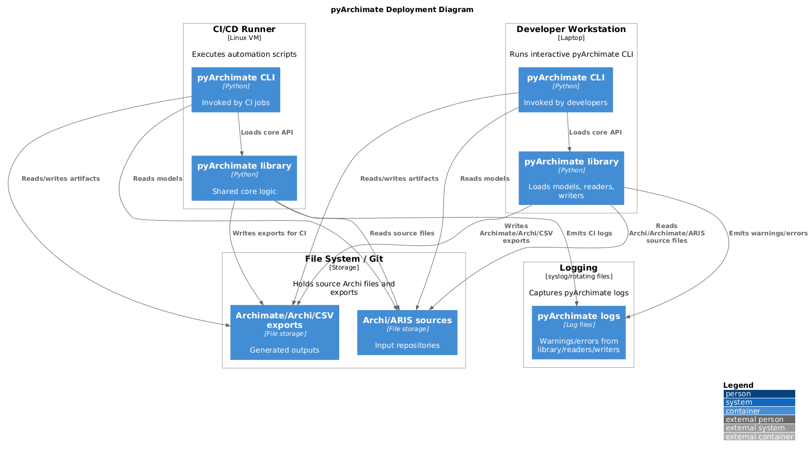

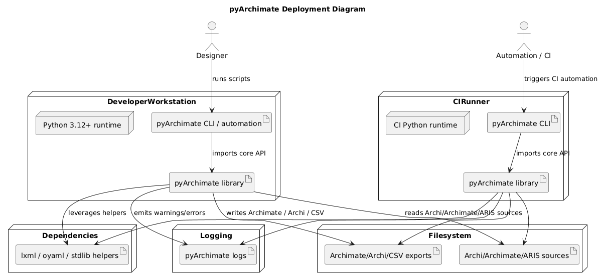

``class.puml`` / ``object.puml`` / ``composite.puml``
  UML views that sketch the static structure of `Model`, `Element`, `Relationship`, and the associated
  helper utilities.

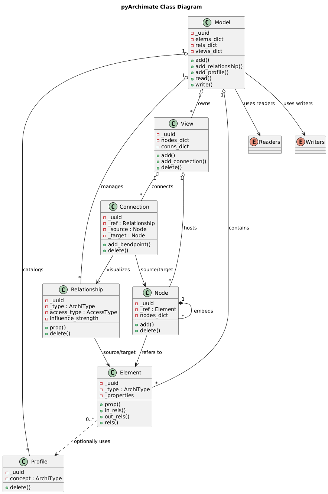

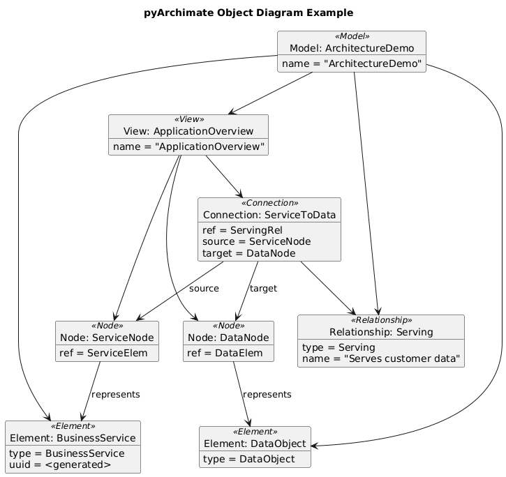

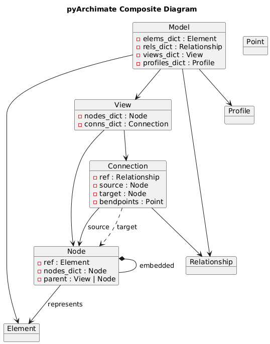

``state.puml``
  State diagram illustrating the `Model` lifecycle as it moves from empty through populated, view ready, serialized, and invalid states when validations fail.

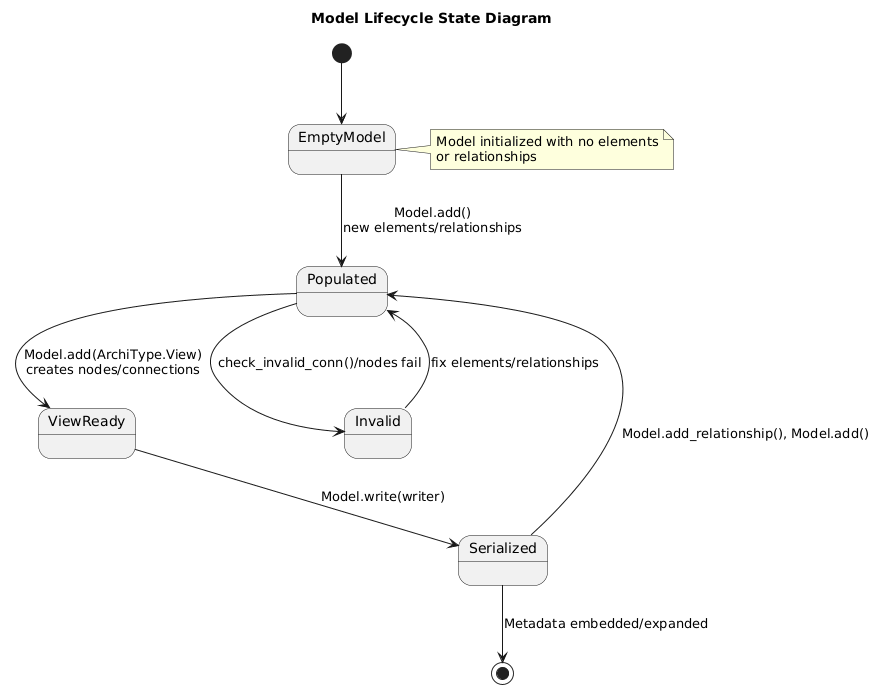

``sequence.puml``
  Sequence diagram depicting how the CLI/script invokes `Model.read`, how readers populate `Elements`/`Relationships`, and how writers serialize the resulting model.

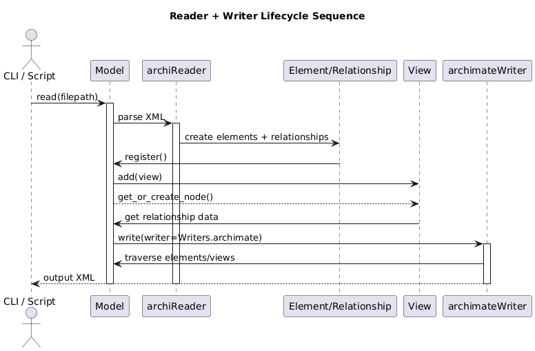

``activity.puml``
  Activity diagram of view construction: creating models, adding elements/relationships, building views, and writing outputs.

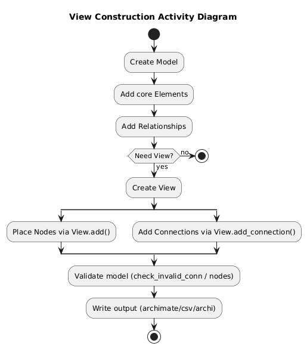

``communication.puml``
  Communication diagram showing runtime message paths between `Model`, `Element`, `Relationship`, `View`, `Node`, and `Connection` during CRUD operations.

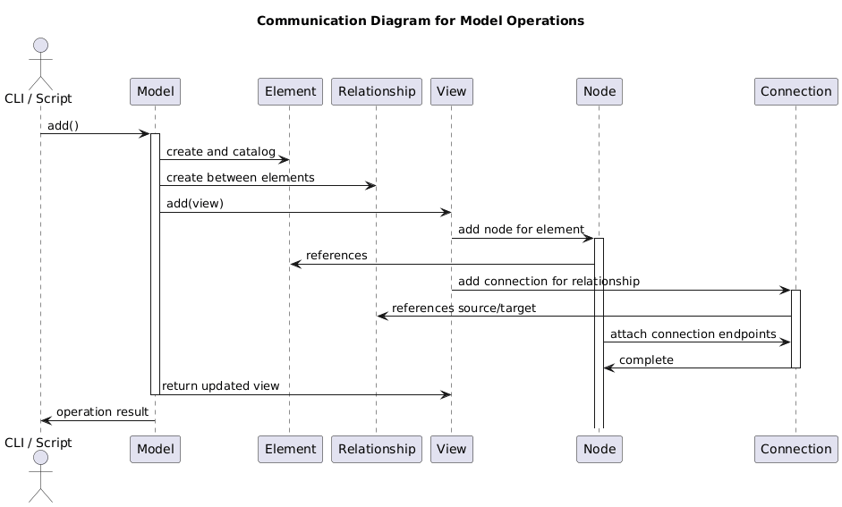

Rendering
---------

To regenerate the PNG artifacts locate the PlantUML renderer and run the helper script:

```
./scripts/render_diagrams.sh
```

The script encodes every PlantUML source, hits `${PLANTUML_SERVER:-https://www.plantuml.com/plantuml}`, follows redirects, and retries slow transfers so the loop can finish. Set `PLANTUML_SERVER` if you want to target a different host (for example `export PLANTUML_SERVER=http://host.containers.internal:8080`), otherwise it defaults to the public PlantUML service.

If you add or refactor diagrams, update this document with a short explanation of the new view and add the source file to the script so it continues to be rendered automatically.
