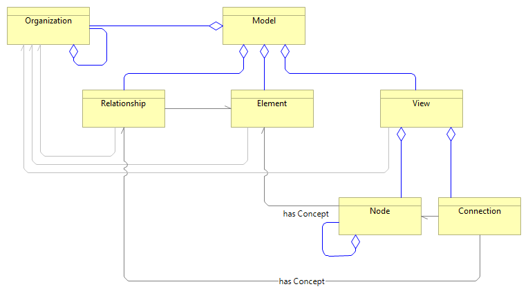

pyArchimate – Public API shim
==============================

``pyArchimate.pyArchimate`` is a compatibility shim that re-exports the full
public API from the individual sub-modules (:doc:`model`, :doc:`element`,
:doc:`relationship`, :doc:`view`, :doc:`enums`, :doc:`exceptions`,
:doc:`helpers`).  Importing from this shim gives access to every public
symbol in one place.

Module contents
---------------

.. automodule:: pyArchimate.pyArchimate
   :members:
   :undoc-members:
   :show-inheritance:

